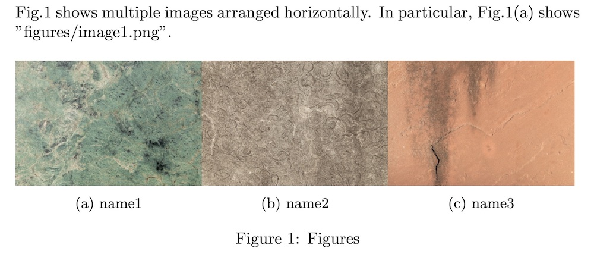

# TeX

## [multiplegraphics.sty](https://github.com/elerac/hikari/blob/master/tex/multiplegraphics.sty)

```tex
Fig.\ref{fig:myfigures} shows multiple images arranged horizontally. 
In particular, Fig.\ref{fig:myfigures}\subref{fig:name1} shows "figures/image1.png".

\begin{figure}[htbp]
    \newcommand{\figuresinfo}{
    {figures/image1.png}/{name1}/{fig:name1},
    {figures/image2.png}/{name2}/{fig:name2},
    {figures/image3.png}/{name3}/{fig:name3}}
    
    \includemultiplegraphics{\figuresinfo}
    \caption{Figures}
    \label{fig:myfigures}
\end{figure}
```

